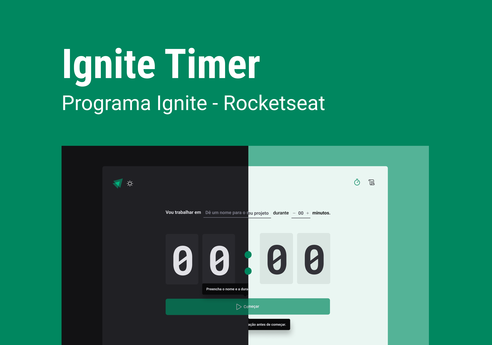

<h1 align='center' >
  💻Ignite Timer
</h1>

  [Ferramentas](#ferramentas)
  |
  [Projeto](#projetos)
  |
  [Aprendizado](#aprendizado)
  |
  [Designer](#designer)
  |
  [Licença](#licença)

  

  

## 🧰Ferramentas

Para desenvolver o projeto, recorri às seguintes ferramentas:

- React + vite
- TypeScript
- styled-components
- react-router

## 💻Projeto

O projeto é uma aplicação com o objetivo de ajudar as pessoas a gerenciar o tempo que dedicam a uma tarefa.

Acesse o site Ignite timer aqui 🔗[link](https://matheus369k.github.io/ignite-timer/).

O site foi promovido no modulo 2, do curso de react na 🔗[RocketSeat](https://app.rocketseat.com.br/).

## 🚀Aprendizado

Ao criar esse projeto, tive varias novas experiencias, a mais importante para mim e a de ter que usar 🔗[styled-components](https://styled-components.com/), para criar o estilo da aplicação, sendo a minha primeira vez implementado essa biblioteca. 

Durante os passos finais de desenvolvimento resolvi aplica notificações quando, interromper ou concluir uma tarefa, para isso resolvi usar uma biblioteca especializada, minha escolha foi a 🔗[iziToast](https://izitoast.marcelodolza.com/), mesmo nunca tendo a usado.

Para poder calcular o tempo fora usado duas datas criadas pelo objeto 🔗[Date()](https://developer.mozilla.org/en-US/docs/Web/JavaScript/Reference/Global_Objects/Date), contudo não tinha muita experiencia, aplicando a em projeto, então foi um bom desafio usa-la, visando um tempo mais preciso.

## 🎨Designer

O designer do projeto foi desenvolvido pela 🔗[RocketSeat](https://app.rocketseat.com.br/), no curso de react, o projeto foi usado como parte do aprendizado do modulo 2.

Para poder acessar o Figma do projeto clique aqui 🔗[link](https://www.figma.com/design/BS98azCMgHqR61u8oZZpxs/Ignite-Timer-(Community)?node-id=0-1&t=SJJ3G9SBROFe3Zb3-1) 

## 📜Licença

A linceça usado foi MIT, acesse aqui 🔗[link](/LICENSE.txt)